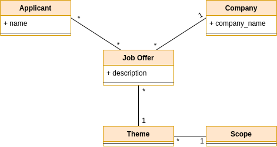
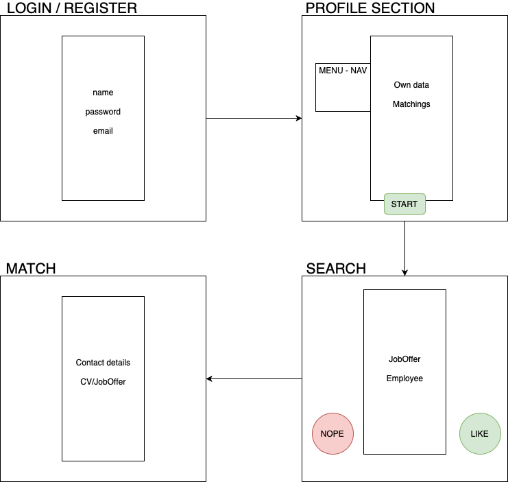

# Jobinder

The main idea of the project is to develop a web app that matches companies and applicants.

Each company will post job offers, that can be visualized by applicants. Both applicants and companies will navigate through job offers and applicants respectively and they will "like" or "nope" them. In match case both will get contact data of each other. 

Applicants as well as job offers are related to a certain scope.
### Entities
* Company
* Applicant
* JobOffer
* Scope
* Theme

In the next figure we define a basic model diagram, including only the main fields for each entity.

We define the intended functions:
* Register company.
* Register applicant.
* Register job offer.
* List applicants to companies.
* List job offers to applicants.
* 'LIKE' Job Offers/Applicants.
* 'NOPE' Job Offers/Applicants.
* Edit own profile by companies and applicants.
* Delete job offers.

### Views

* Login / Register view: user as applicant or company must sign up/in in order to access the application. 
Without this, the application cannot be used. 
> **_NOTE_** All user data introduced and stored such as name, phone... will not be related to real data to prevent implementing GDPR.
* Profile Section: display user data, possibility to change, recent "matches".
* Search Section: either applicants or companies will visualize each others offers which can "Like" or "Nope" them.
* Match: whenever both "Like" each other a view with contact details will be shown.

### Usage

1. Clone the repository and execute it
`python manage.py runserver [port]`
2. Open the browser with localhost:port.
3. Now you will be running the application with an empty database. You can register some applicants and companies to interact.
    1. _bis_ Should you use our database you have to migrate it. 
    
    `python manage.py makemigrations jobsearcher`
    
    `python manage.py migrate jobsearcher`
    
    2. You will have access to admin page with username 'admin'; password 'bruh'.
    3. Each user, applicant and company, have login details username _username_; password 'bruh1234'.
4. Now you can interact login into the profile and explore for jobOffers and Applicants!

### TO-DO list

- [x] Login / Register
    - [ ] (O) Email verification
    - [ ] (O) Ask for user first, then password
    - [x] After register require profile description
- [x] Profile section
    - [X] Allow edit profile 
    - [X] Show current matches
    - [x] Company: register and modify own Job Offers
- [x] Search section
    - [x] Implement search algorithm
        - [ ] (O) Show again repeated profiles in 1 week
        - [ ] (O) Filter by nearby location
    - [x] Allow 'LIKE' & 'NOPE' users
    - [x] Company: register and modify own Job Offers
- [x] Search section
    - [x] Implement search algorithm
        - [ ] (O) Show again repeated profiles in 1 week
        - [ ] (O) Filter by nearby location
    - [x] Allow 'LIKE' & 'NOPE' users
- [x] Match applicants-companies
    - [X] Show contact data
    - [ ] (O) Send notification to email 
    - [ ] (O) Communication / Chat
- [X] Predefine scopes and respective themes.

#### Authors
* [Genov Draganova, Aleks](https://github.com/AleksSG)

* [Uali, Bilal](https://github.com/bilaluali)
